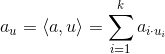
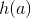
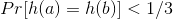
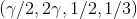
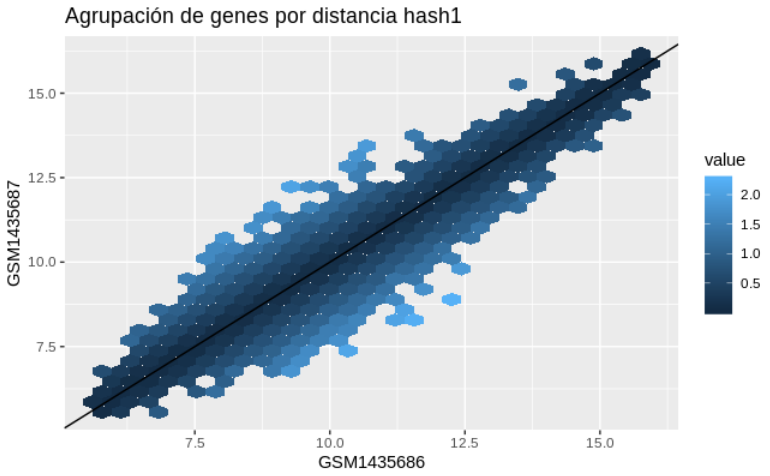
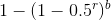
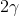
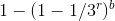

# Gene Expression Explorer

## Introducción 

Después de mucho rollo biológico ...

## Cálculo de similitud entre genes

El objetivo de calcular la similitud entre genes es encontrar al conjunto de genes que se expresan con intensidad similar en un microarreglo, esta intensidad representa el número de copias expresadas de este gen dentro de cada muestra. Este conjunto de genes que se desea encontrar no sólo debe ser similar en intensidad entre cada gen, sino que también debe presentar cierta homogeneidad a lo largo de cáda muestra para considerarse representativo de lo que expresa la muestra, es decir, si las muestras en el microarreglo comparten alguna caracteística como podría ser una mutación, una enfermedad o algúna otro factor particular, es necesario que los genes con intensidad alta se repitan entre todos los integrantes de la muestra. 

### Aproximación 

Por lo anteriormente mencionado es evidente que la distribución de las intensidades de los genes tiene una distribución espacial clara en  siendo n el número de muestras en el microarreglo, lo que nos hace pensar que la distribución en el espacio de la magnitud de la intensidad de los genes será resultado de la homogenieidad del vector dado por las muestras de cada gen.

El proceso de agrupamiento de los genes en el espacio no es intuitiva ya que involucra dimensiones altas, el rango del número de muestras en los microarreglos no es definido, es tan común encontrar información que incluya 3 muestras como encontrar microarreglos con mas de 40 muestras.  Existen métodos de agrupación por vecinos más cercanos eficientes para analizar puntos en espacios de altas dimensiones y uno de ellos es el método de *local sensitive hashing (LSH) Euclideano*.

### LSH Euclideano 

#### **Funciones Hash**

La intuición detrás del método de *LSH Euclideano* está basada en la proyección de los puntos sobre líneas aleatorias generadas en el espacio, estas proyecciones, resultado del producto punto entre la línea y el vector de coordenadas, se dividen en cubetas de manera equitativa. Una función hash es realmente una línea aleatoria en el espacio y el valor hash que se genera a partir de cada punto *x* es el número de cubeta sobre la cual está proyectado.

Si tenemos dos vectores la distancia entre ellos es equivalente a: 

La función hash *h* se define como sigue:

-   Se toma un vector unitario aleatorio  
-   Se proyecta  sobre *u*:

    

    Por lo que la distancia de las proyecciones será menor o igual a la distancia entre los puntos
     
     

-   Se crean cubetas de tamaño  en *u* que ahora se encuentra en , este valor del índice de la cubeta es lo que regresará la función hash .

    Si  entonces la probabilidad . Por otra parte si  entonces la probabilidad . Esto se traduce en la familia sensible a la localidad .

#### **Demostración gráfica de funciones hash**

Para comprender mejor el método de *LSH Euclideano*, es conveniente visualizar un espacio bidimensional en el cual se pueda rrepresenta geométricamente el funcionamiento del método. Gráficamente el *LSH Euclideano* funciona como lo expresa la siguiente figura, en la que las distancias hacia la línea aleatoria son agrupadas con colores, en este caso ese grupo de distancias sería el valor que arrojaría la función hash .

Hablar de un espacio bidimensional en el proyecto de genes es hablar de un microarreglo que contenga unicamente dos muestras (cáda eje representa una muestra distinta), como se mencionó anteriormente esto es prácticamente imposible ya que un análisis real implica clasificar puntos en espacios n-dimensionales.

Si se generaran otros trazos de líneas aleatorias sobre el espacio de , las funciones hash regresarían nuevos valores que clasifican a los puntos dentro de distintas cubetas. Las siguientes figuras son un ejemplo de este proceso.

#### **Técnica de bandas**
 
La técnica de bandas sirve para encontrar documentos de similitud alta, con distintos umbrales de similitud alta. Si suponemos que tenemos un total de *k* hashes, divididos en *b* bandas de tamaño *r*, en dónde *k*=*b* *r*. Un par de documentos coinciden en una banda cuando todos los hashes de la banda son iguales y un par de documentos es un **par candidato** cuando coinciden al menos en una banda.

En el análisis de genes se utilizaron 200 funciones hash (*k*=200), con 25 bandas (*b*=25) de tamaño 8 (*r*=8). Si la distancia es mayor a 5 la probabilidad de que los genes tengan el mismo hash es , lo que en el caso de nuestro análisis sería una probabilidad de 9.3%. Si la distancia es menor a  entonces la probabilidad que tenga el mismo hash es menor a , lo que en nuestro caso sería una probabilidad de 0.3%. Esto nos hace concluir que preferimos evitar falsos positivos garantizando que los genes dentro de las canastas tengan una grán probabilidad de ser cercanos.

Para nuestro modelo de *LSH Euclideano* la configuración de la técnica de bandas se desempeña como se ilustra en la figura siguiente, en la cual es claro que se discrimina por candidatos que tengan similitud alta.

