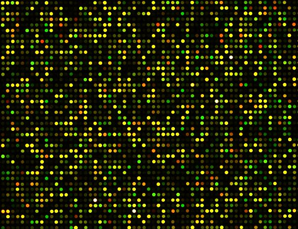

## Puntos básicos de los microarreglos

Básicamente, un microarray (o microarreglo) detecta la intensidad con que un gen se expresa en una muestra específica. En la siguiente imagen podemos ver un chip de microarray, donde cada punto es un gen específico y la intensidad con la que brilla indica el número de copias expresadas de ese gen. Los diferentes colores se deben a que cada muestra se tiñe con un color distinto.



Una vez que el software lee estos chips, el resultado final es un archivo con la información de metadata (tipo de estudio, tipo de chip, qué muestras tenemos, etcétera) y una matriz donde cada renglón es un gen y cada columna una muestra. Las muestras pueden ser de todo tipo: un estudio puede ser la misma persona a lo largo de su tratamiento y cada muestra es un punto en el tiempo, las muestras pueden ser personas con o sin tratamiento, pueden ser réplicas de un mismo cancer único, etcétera.

Los datos se encuentran dentro de la base de datos [GEO](https://www.ncbi.nlm.nih.gov/gds/) (Gene Expression Omnibus). Ahí pueden, por ejemplo, buscar "cancer pancreas Homo sapiens" y obtener resultados sobre eso.

Notarán que cada archivo tiene un código de acceso único de 7 letras . Con este código podemos descargar los resultados de cada estudio. Para hacerlo en R, usamos lo siguiente (tomemos como ejemplo el primer resultado de la búsqueda anterior, con el código `GDS5627`).

```r
library(GEOquery)
 
gds <- getGEO('GDS5627', destdir=".")
Using locally cached version of GDS5627 found here:
./GDS5627.soft.gz 
Parsed with column specification:
cols(
  .default = col_double(),
  ID_REF = col_character(),
  IDENTIFIER = col_character()
)
See spec(...) for full column specifications.
 
# vemos la descripción del estudio
Meta(gds)$description[1]
[1] "Analysis of dasatinib-resistant and dasatinib-sensitive PC cell lines. Dasatinib, a small-molecule kinase inhibitor, is FDA-approved for PC, but certain PC cells can have intrinsic or acquired resistance to dasatinib. Results provide insight into molecular basis of dasatinib-resistance in PC cells."
# vemos cuántos genes tenemos
Meta(gds)$feature_count
[1] "48107"
# número de muestras (columnas)
Meta(gds)$sample_count
[1] "18"
# organismo
Meta(gds)$sample_organism
[1] "Homo sapiens"
```

Seguramente dirán "Qué bonito Francisco, pero ¿cómo rayos extraemos los datos?". No sean tan impacientes.

```r
# Finalmente, para extraer la tabla como matriz
m <- as.matrix(Table(gds)[,3:as.numeric((Meta(gds)$sample_count)) + 2])
rownames(m) <- Table(gds)$ID_REF
m <- m[rowSums(is.na(m)) != ncol(m), ]
head(m)
             GSM1435686 GSM1435687 GSM1435688 GSM1435689 GSM1435690 GSM1435691 GSM1435692 GSM1435693 GSM1435694 GSM1435695 GSM1435696
ILMN_1343291         15.99480   15.99480   15.94500   15.96430   15.94840   15.94840   15.91460   15.97830   15.94840   15.87840   15.99860
ILMN_1343295          14.50140   14.07200   13.92740   14.15910   14.73720   14.60270   14.76980   14.98320   14.30460   15.02070   14.40170
ILMN_1651199    6.75900    6.57201    6.71092    6.89837    6.46524    6.81587    6.70246    6.72795    6.60746    6.39744    6.35774
ILMN_1651209         6.55354    7.08429    6.78487    7.12899    6.78715    6.94572    6.60418    6.71635    6.99450    6.73340    6.57911
ILMN_1651210          7.05404    6.82299    6.86264    6.98001    6.65215    6.89471    6.95141    6.95423    6.74555    6.80384    6.42432
ILMN_1651221    7.31565    7.17764    6.92481    7.20439    7.11389    6.95629    7.05686    7.05108    7.00221    6.99914    6.84523
             GSM1435697 GSM1435698 GSM1435699 GSM1435700 GSM1435701
ILMN_1343291         15.96020   15.99860   15.96020   15.80370   15.99770
ILMN_1343295          14.22770   14.50890   14.75850   14.28490   14.84670
ILMN_1651199    6.61047    6.55878    6.64684    6.64749    6.69372
ILMN_1651209         7.01546    6.75109    6.98075    6.71622    6.83783
ILMN_1651210          6.74291    6.50507    6.87354    6.65273    6.82600
ILMN_1651221    6.98378    6.81080    6.83816    6.84439    7.02283

```

Y listo. Nos queda una matriz con los datos detectados de actividad de cada gen. Estos datos son usualmente transformados y normalizados, como se describe en el capítulo de referencia en esta carpeta. Sin embargo, estas transformaciones varían de estudio a estudio, y creo que meternos con eso sería un desmadre, así que lo mejor es usar los valores como están y simplemente reportar la variable `Meta(gds)$value_type`.

Lo último que podría darnos curiosidad es cómo identificar los genes; después de todo, esos códigos no nos dicen nada.

```r
# determinas qué chip se uso y bajamos la información
plataforma <- Meta(gds)$platform
glp <- getGEO(plataforma, destdir=".")
Using locally cached version of GPL10558 found here:
./GPL10558.soft 
Warning: 3270 parsing failures.
  row        col           expected    actual         file
29537 Unigene_ID 1/0/T/F/TRUE/FALSE Hs.571610 literal data
29538 Unigene_ID 1/0/T/F/TRUE/FALSE Hs.545780 literal data
29539 Unigene_ID 1/0/T/F/TRUE/FALSE Hs.554603 literal data
29540 Unigene_ID 1/0/T/F/TRUE/FALSE Hs.437179 literal data
29541 Unigene_ID 1/0/T/F/TRUE/FALSE Hs.128234 literal data
..... .......... .................. ......... ............
See problems(...) for more details.


# veamos qué rayos bajamos
Meta(glp)$title
[1] "Illumina HumanHT-12 V4.0 expression beadchip"
# sacamos los genes de nuestra muestras
genes <- rownames(m)
gen_db <- Table(glp)[Table(glp)$ID %in% genes,]
 
# veamos, por ejemplo, las características del primer gen.
a <- lapply(gen_db[1,], print)
a
$ID
[1] "ILMN_1343291"

$Species
[1] "Homo sapiens"

$Source
[1] "RefSeq"

$Search_Key
[1] "NM_001402.4"

$Transcript
[1] "ILMN_5311"

$ILMN_Gene
[1] "EEF1A1"

$Source_Reference_ID
[1] "NM_001402.5"

$RefSeq_ID
[1] "NM_001402.5"

$Unigene_ID
[1] NA

$Entrez_Gene_ID
[1] 1915

$GI
[1] 83367078

$Accession
[1] "NM_001402.5"

$Symbol
[1] "EEF1A1"

$Protein_Product
[1] "NP_001393.1"

$Probe_Id
[1] "ILMN_1343291"

$Array_Address_Id
[1] 3450719

$Probe_Type
[1] "S"

$Probe_Start
[1] 1294

$SEQUENCE
[1] "TGTGTTGAGAGCTTCTCAGACTATCCACCTTTGGGTCGCTTTGCTGTTCG"

$Chromosome
[1] "6"

$Probe_Chr_Orientation
[1] "-"

$Probe_Coordinates
[1] "74284362-74284378:74284474-74284506"

$Cytoband
[1] "6q13c"

$Definition
[1] "Homo sapiens eukaryotic translation elongation factor 1 alpha 1 (EEF1A1), mRNA."

$Ontology_Component
[1] "All of the contents of a cell excluding the plasma membrane and nucleus, but including other subcellular structures [goid 5737] [evidence IEA]; All of the contents of a cell excluding the plasma membrane and nucleus, but including other subcellular structures [goid 5737] [evidence IEA]; All of the contents of a cell excluding the plasma membrane and nucleus, but including other subcellular structures [goid 5737] [pmid 3512269] [evidence TAS]; That part of the cytoplasm that does not contain membranous or particulate subcellular components [goid 5829] [pmid 10368288] [evidence EXP]; A multisubunit nucleotide exchange complex that binds GTP and aminoacyl-tRNAs, and catalyzes their codon-dependent placement at the A-site of the ribosome. In humans, the complex is composed of four subunits, alpha, beta, delta and gamma [goid 5853] [pmid 2564392] [evidence TAS]"

$Ontology_Process
[1] "The successive addition of amino acid residues to a nascent polypeptide chain during protein biosynthesis [goid 6414] [evidence IEA]; The successive addition of amino acid residues to a nascent polypeptide chain during protein biosynthesis [goid 6414] [pmid 8812466] [evidence TAS]; The successive addition of amino acid residues to a nascent polypeptide chain during protein biosynthesis [goid 6414] [pmid 15189156] [evidence EXP]"

$Ontology_Function
[1] "Interacting selectively with a nucleotide, any compound consisting of a nucleoside that is esterified with (ortho)phosphate or an oligophosphate at any hydroxyl group on the ribose or deoxyribose moiety [goid 166] [evidence IEA]; Functions in chain elongation during polypeptide synthesis at the ribosome [goid 3746] [evidence IEA]; Catalysis of the reaction: GTP + H2O = GDP + phosphate [goid 3924] [evidence IEA]; Interacting selectively with GTP, guanosine triphosphate [goid 5525] [evidence IEA]; Interacting selectively with a nucleotide, any compound consisting of a nucleoside that is esterified with (ortho)phosphate or an oligophosphate at any hydroxyl group on the ribose or deoxyribose moiety [goid 166] [evidence IEA]; Functions in chain elongation during polypeptide synthesis at the ribosome [goid 3746] [evidence IEA]; Catalysis of the reaction: GTP + H2O = GDP + phosphate [goid 3924] [evidence IEA]; Interacting selectively with GTP, guanosine triphosphate [goid 5525] [evidence IEA]; Interacting selectively with a nucleotide, any compound consisting of a nucleoside that is esterified with (ortho)phosphate or an oligophosphate at any hydroxyl group on the ribose or deoxyribose moiety [goid 166] [evidence IEA]; Catalysis of the reaction: GTP + H2O = GDP + phosphate [goid 3924] [evidence IEA]; Interacting selectively with GTP, guanosine triphosphate [goid 5525] [evidence IEA]; Interacting selectively with a nucleotide, any compound consisting of a nucleoside that is esterified with (ortho)phosphate or an oligophosphate at any hydroxyl group on the ribose or deoxyribose moiety [goid 166] [evidence IEA]; Catalysis of the reaction: GTP + H2O = GDP + phosphate [goid 3924] [evidence IEA]; Interacting selectively with GTP, guanosine triphosphate [goid 5525] [evidence IEA]; Interacting selectively with a nucleotide, any compound consisting of a nucleoside that is esterified with (ortho)phosphate or an oligophosphate at any hydroxyl group on the ribose or deoxyribose moiety [goid 166] [evidence IEA]; Functions in chain elongation during polypeptide synthesis at the ribosome [goid 3746] [evidence IEA]; Catalysis of the reaction: GTP + H2O = GDP + phosphate [goid 3924] [evidence IEA]; Interacting selectively with any protein or protein complex (a complex of two or more proteins that may include other nonprotein molecules) [goid 5515] [pmid 17373842] [evidence IPI]; Interacting selectively with any protein or protein complex (a complex of two or more proteins that may include other nonprotein molecules) [goid 5515] [pmid 15231747] [evidence IPI]; Interacting selectively with GTP, guanosine triphosphate [goid 5525] [pmid 3512269] [evidence TAS]"

$Synonyms
[1] "EEF1A; FLJ25721; CCS-3; PTI1; CCS3; MGC102687; MGC16224; EF-Tu; eEF1A-1; EEF-1; MGC131894; HNGC:16303; GRAF-1EF; LENG7; EF1A"

$Obsolete_Probe_Id
[1] "EEF1A; PTI1; MGC16224; eEF1A-1; EF-Tu; EEF-1; HNGC:16303; GRAF-1EF; LENG7; EF1A"

$GB_ACC
[1] "NM_001402.5"
```

Qué bonito.
